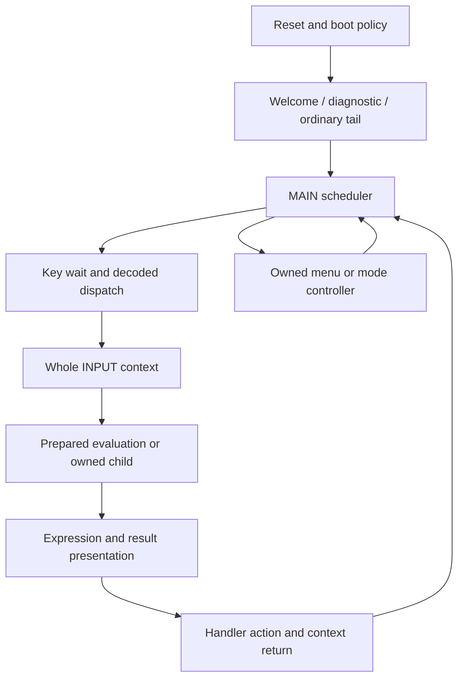

# Input and controller execution

The C runtime retains controller locals in named structures and advances them
through semantic phases. A phase boundary is not one processor instruction.
Numeric evaluation may perform a bounded calculation with cancellation polls
inside a phase.

The reset entry corresponding to original 6F82 is implemented in
[fx_boot.c](../../../csrc/platform/fx_boot.c). It applies retained-data policy
rather than clearing the entire device. Initialization corresponds to D6FE;
retained continuation includes D730..D7AE.
[fx_boot_events.c](../../../csrc/platform/fx_boot_events.c) owns the bounded
welcome, diagnostic and ordinary-mode tails. An unavailable boot dependency
remains a typed request rather than an artificial READY result.

[MAIN](../../../csrc/platform/fx_main_loop.c) selects a handler, runs it, receives
its continuation and finishes the cycle, including display publication. The key
controller handles wait/readiness and decoding; the host owns raw packets.
SCREEN18 admission and its return policy precede the later grid body.

[Whole INPUT](../../../csrc/ui/fx_ui_controller.c) models original D9EE, including
the prepared boundary at DA58. It keeps the editing context, dispatches an action,
may enter a subordinate evaluator or TABLE path, redraws and returns its context
byte. That return is distinct from the subordinate INPUT action byte and a
caller's selected CALC or distribution action.

[Subordinate INPUT](../../../csrc/ui/fx_input_controller.c) corresponds to the
1F12A evaluator/controller family, with prepared boundary 1F2AC. It evaluates
from an addressed prepared source, selects VERIFY handling when appropriate and
optionally presents the result. Admission, arithmetic and presentation retain
their separate status contracts.

## Ownership and boundaries

The committed 130-unit runtime owns ordinary INPUT, MODE/SETUP, parameter menus,
linear/polynomial EQN and TABLE routing. The pending 144-unit runtime additionally
routes retained CALC/SOLVE, inequality, MATRIX/VECTOR, STAT editor and distribution
admission/editor/numeric controllers. Do not assume these newer START phases
exist in the older deployed runtime.

The main owners are [runtime](../../../csrc/platform/fx_runtime.c),
[MODE/SETUP](../../../csrc/ui/fx_mode_setup.c),
[parameter provider](../../../csrc/ui/fx_parameter_menu_provider.c),
[EQN](../../../csrc/ui/fx_equation_controller.c),
[polynomial EQN](../../../csrc/ui/fx_polynomial_equation_controller.c) and
[TABLE](../../../csrc/table/fx_table_body.c). Other owned bodies are named by the
runtime's literal source includes.

The original STAT/distribution/TABLE grid at E22A..E450 keeps nine **record
addresses**, not nine cached numeric values. Navigation, selected-record
preparation, nested INPUT and painting have distinct service order. A fresh
nested INPUT return can be replaced by the live mode byte; it is not uniformly
the nested INPUT action. Distribution hides result pointers unless the phase
byte is exactly 5. Malformed selected coordinates and wrapping raw grid state
are admission limits, not ordinary supported UI geometry. The pending local
owners are csrc/ui/fx_statistics_editor_controller.c and
csrc/ui/fx_distribution_editor_controller.c. Those files are not part of the
committed 130-unit baseline.

Local evidence:

- analysis/understanding/ui-mid/controller-assist/controller-notes.md
- analysis/understanding/ui-mid/controller-assist/independent-review/REVIEW.md
- analysis/understanding/ui-mid/grid-controller/grid-notes.md
- analysis/understanding/ui-mid/grid-controller-errata/GRID-BUSY-ERRATUM.md

Older narratives describing STAT, distribution or CLEAR as wholly delegated can
predate later C owners. Use current source and its pinned test epoch rather than
carrying those historical gap statements forward.
